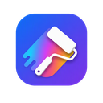

<p align="center">
  
</p>

<h1 align="center">PageDye</h1>

<p align="center">给你常用的网站换上真正属于自己的背景。</p>

<p align="center">
  <a href="https://pagedye.pages.dev">官网</a> ·
  <a href="https://github.com/OnyxAxisOwO/PageDye/releases/latest">下载最新版</a> ·
  <a href="CHANGELOG.md">更新日志</a>
</p>

PageDye 是一个浏览器扩展，可以把网站背景换成纯色、渐变、图片或动态特效。每个网站的设置单独保存，下次打开时会自动恢复。

它支持 Chrome、Edge、Brave、Firefox 以及 Firefox for Android。手机和平板还可以使用精简版 **PageDye Lite**。

## 它能做什么

- 使用纯色、渐变、本地图片、网络图片或 16 种动态特效作为背景
- 为白天和夜间设置不同背景，并跟随系统主题自动切换
- 调整图片透明度、模糊度、亮度、对比度、灰度和色相
- 给网页卡片添加磨砂玻璃效果
- 保存整套配置为预设，并批量应用到多个网站
- 按网址、路径或子域名使用不同配置
- 导出和导入备份，配置和本地图片都可以一起迁移

所有配置默认只保存在浏览器本地。PageDye 没有账号、云同步、广告或遥测。

## 安装

### 桌面浏览器

1. 从 [GitHub Releases](https://github.com/OnyxAxisOwO/PageDye/releases/latest) 下载最新版 `pagedye-v*.zip`。
2. 解压下载的文件。
3. 按浏览器对应的方式加载解压后的文件夹。

**Chrome / Edge / Brave**

1. 打开 `chrome://extensions`；Edge 使用 `edge://extensions`。
2. 开启“开发者模式”。
3. 点击“加载已解压的扩展程序”，选择刚才解压的文件夹。

**Firefox 140+**

1. 打开 `about:debugging#/runtime/this-firefox`。
2. 点击“临时载入附加组件”。
3. 选择解压目录中的 `manifest.json`。

Firefox 版本目前未经 Mozilla 签名，因此浏览器重启后需要重新载入。Firefox for Android 需要 142 或更高版本。

### 手机和平板

PageDye Lite 是通过脚本管理器安装的轻量版，适合 Android 和 iPhone/iPad：

1. Android 上安装 Tampermonkey；iPhone/iPad 上安装 Userscripts。
2. 打开 [PageDye Lite 安装链接](https://raw.githubusercontent.com/OnyxAxisOwO/PageDye/main/userscript/pagedye.user.js)。
3. 在脚本管理器的确认页完成安装。

安装后，网页右下角会出现 PageDye 按钮。Chrome 移动版不支持扩展或脚本管理器，建议改用 Edge、Firefox 或其他支持扩展的浏览器。

## 开始使用

1. 打开想要修改的网站，点击浏览器工具栏中的 PageDye 图标。
2. 选择纯色、渐变、图片或特效，然后调整透明度和模糊度。
3. 设置会自动保存，只对当前网站生效。

弹窗中的预设可以快速应用“浅色极光”“深色极光”“日间”和“夜间”配置。点击保存按钮还能把当前网站的完整设置保存为自己的预设。

## 背景没有变化？

有些网站会用不透明容器盖住页面背景。通常按下面的顺序处理即可：

1. 把弹窗最上方的运行模式从“普通”切换为“增强”。
2. 仍然无效时尝试“强兼”模式。
3. 如果只想修改某个区域，在高级设置中使用“背景选择器”，然后点击网页上的目标区域。

运行模式只针对当前网站保存。强兼模式会尝试清除更多遮挡背景，不建议作为所有网站的默认设置。

浏览器内部页面、扩展商店和其他受保护页面不允许扩展修改，这是浏览器本身的安全限制。PageDye 会在这些页面显示禁用状态。

## 完整版和 Lite

| | 浏览器扩展 | PageDye Lite |
|---|---|---|
| 适合设备 | 桌面浏览器、Firefox for Android | Android、iPhone、iPad、Safari |
| 背景与特效 | 完整支持 | 支持常用功能 |
| 磨砂玻璃与兼容模式 | 支持 | 支持 |
| 多站点管理与批量操作 | 支持 | 不支持 |
| 配置预设与备份 | 完整预设、分组与批量备份 | 当前网站导入/导出 |
| 自定义 Canvas 动效 | 支持 | 不支持 |

## 更多功能

### 配置预设与站点分组

设置页可以保存自定义预设、管理站点分组，并把同一套配置批量应用到多个网站。也可以只导出或导入选中的网站，不必恢复整份备份。

### URL 规则

同一个网站的不同页面可以使用不同背景。例如，可以为首页、阅读页面和设置页面分别配置。规则支持完整网址、路径前缀、hostname 和 `*.example.com` 形式的子域名。

### 自定义动效和 CSS

熟悉前端开发的用户可以编写自己的 Canvas 动效或为网站添加自定义 CSS。自定义动效在隔离沙箱中运行，详细用法见 [自定义动效 API 文档](https://pagedye.pages.dev/custom-effects.html)。

只导入你信任的 JavaScript 动效代码。

## 隐私与权限

PageDye 使用的权限都直接服务于背景功能：

- `storage` 和 `unlimitedStorage`：保存网站配置和本地图片
- `scripting`：把背景和样式应用到当前网页
- `<all_urls>`：让扩展能在你访问的网站上工作

PageDye 不会把配置上传到服务器。只有当你主动填写远程图片或 URL 动效地址时，浏览器才会访问对应网站。

备份文件使用当前 schema v3 格式，并兼容旧版备份。导入内容会经过格式、大小和危险字段检查，不会覆盖扩展总开关、调试状态等保留设置。

## 本地开发

项目不需要构建步骤，克隆仓库后即可作为未打包扩展加载。

运行测试和发布前检查：

```bash
npm run check
```

## 许可证

[MIT](LICENSE)
