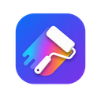

<p align="center">
  
</p>

<h1 align="center">PageDye</h1>

<p align="center">
  <strong>Transform almost any website with AI — without writing a single line of code.</strong>
</p>

<p align="center">
  <a href="https://pagedye.pages.dev">Website</a> ·
  <a href="https://microsoftedge.microsoft.com/addons/detail/jdfkphphagodkilembkklhnepbnnkihh">Edge Add-ons Store</a> ·
  <a href="https://github.com/OnyxAxisOwO/PageDye/releases/latest">GitHub Releases</a> ·
  <a href="https://pagedye.pages.dev/privacy.html">Privacy Policy</a> ·
  <a href="CHANGELOG.md">Changelog</a>
</p>

<p align="center">
  <strong>English</strong> | <a href="README_zh.md">简体中文</a>
</p>

---

## 5-Second Overview

Traditionally, personalizing or theming websites meant dealing with arcane CSS rules, brittle DOM selectors, DevTools inspection, or writing complex Tampermonkey userscripts.

**PageDye changes that.**

PageDye is an **AI-powered, zero-code website customization browser extension** built for everyone. Whether you want to turn a glaring white documentation site into eye-friendly dark glassmorphism, add animated aurora particle wallpapers to your daily tools, or simply describe your dream style in plain English to AI — PageDye instantly transforms the page while preserving crystal-clear text readability.

- ❌ **No CSS or JavaScript required**
- ❌ **No DevTools or DOM debugging needed**
- ❌ **No need to find separate themes for every single website**
- ✅ **Natural language prompts + Intuitive visual controls + Universal compatibility**

---

## Visual Transformation: Describe What You Want

```
[ Original Website ]
  Default stark white / glaring colors / eye strain during night reading
      ↓
[ Natural Language AI Prompt ]
  "Make this page dark glassmorphism with custom aurora gradient, keeping text crystal clear"
      ↓
[ Transformed by PageDye ]
  Sleek Glassmorphism + Dynamic Aurora Shader + Auto-Calibrated Readability Contrast
```

---

## Three Core Pillars

### 🤖 1. AI-Assisted Customization
- **Context-Aware Intelligence**: Automatically extracts dominant page colors and container layouts, generating cohesive themes that match the site's content.
- **Multi-Turn Conversational Refinement**: Iterate effortlessly without starting over (e.g., *"Make it darker"*, *"Add a warm retro vibe"*, *"Enhance cyberpunk glowing accents"*).
- **Hardcoded Readability Guard**: Built-in contrast protection strictly ensures original body copy remains legible against any generated wallpaper.
- **Multi-Model & Vision Support**: Connect your own Claude, OpenAI, DeepSeek, OpenRouter, or local Ollama endpoints; attach reference images for vision-guided theming.

### 🌐 2. One Extension. Almost Any Website.
- **Universal Compatibility**: One tool works across blogs, documentation sites, developer platforms, and social feeds without needing site-specific extensions.
- **Smart Compatibility Engine**: Three selectable operational modes (**Standard, Enhanced, Strong**) penetrate stubborn opaque CSS wrappers.
- **Visual Element Picker**: Click any specific container on the page to target background injection or apply frosted glass locally.

### ⚡ 3. Zero Code Required
- **Intuitive Visual Controls**: Adjust colors, gradient angles, glassmorphism blur, and screen filters with smooth visual sliders.
- **What You See Is What You Get**: Real-time live preview. No knowledge of CSS specificity, selectors, or box models required.

---

## Feature Matrix

| Category | Real Capabilities Available in v1.0 |
| :--- | :--- |
| **🎨 Versatile Backgrounds** | Solid colors, linear & radial gradients, local & web high-res wallpapers (Cover, Contain, Tile, Stretch). |
| **✨ 16 Dynamic Shaders** | Built-in Matrix rain, aurora, particle stars, winter snow, typewriter, waves Canvas wallpapers with speed & density tuning. |
| **🎬 Local Video Wallpapers** | Set local MP4 / WebM videos as live backgrounds with opacity, blur, fill, and playback controls. |
| **🧊 Frosted Glass (Glassmorphism)** | Add translucent glassmorphism to target content cards and containers, with independent blur and tint adjustments. |
| **🎛️ Full-Screen Visual Filters** | Fine-tune brightness, contrast, grayscale, invert, hue-rotate, saturation, and opacity for dark/retro comfort. |
| **🖱️ Interactive Custom Cursors** | Solid dots, hollow rings, glowing orbs, and custom image cursors with smooth following, trails, and hover interactions. |
| **⏱️ Day/Night & Time Automation** | Follow system dark/light mode automatically; schedule wallpapers by time of day or rotate via slideshow. |
| **🎯 Per-URL & Wildcard Rules** | Configure visual profiles by full URL, path prefix, root domain, or wildcard subdomains (`*.example.com`). |
| **🔒 100% Local & Privacy-First** | All data and images stay in your browser local storage. No accounts, no ads, no telemetry, with full JSON backup import/export. |

---

## Traditional Customization vs PageDye

| Dimension | Traditional Method (Stylus / Userscripts / Custom CSS) | PageDye (Visual + AI-Powered) |
| :--- | :--- | :--- |
| **Skill Barrier** | Requires proficiency in CSS syntax, DOM selectors, and layout rules | **Zero Barrier**: Natural language prompts or visual sliders |
| **Debugging Cost** | Requires opening DevTools and inspecting elements manually | **Real-Time Live Preview**: Instant one-click application |
| **Maintenance** | Fragile styles break whenever websites update their CSS classes | **Smart Compatibility**: Auto-detects layout hierarchy and containers |
| **Readability** | High risk of illegible text on mismatched backgrounds | **Readability Safety Guard**: Automatic contrast verification |
| **Dynamic Effects** | Writing custom Canvas shaders or video backgrounds is very difficult | **Out of the Box**: 16 Shaders, local video wallpapers, and custom cursors included |

---

## Installation

### Desktop Browsers (Chrome / Edge / Firefox / Brave)

1. **Microsoft Edge (Recommended)**
   - Install directly from the official [Microsoft Edge Add-ons Store](https://microsoftedge.microsoft.com/addons/detail/jdfkphphagodkilembkklhnepbnnkihh) with one click and automatic silent updates.

2. **Chrome / Brave / Other Chromium Browsers (Load Unpacked)**
   - Download the latest `pagedye-v*.zip` from [GitHub Releases](https://github.com/OnyxAxisOwO/PageDye/releases/latest) and extract it.
   - Navigate to `chrome://extensions` in your address bar and enable **Developer mode** in the top-right corner.
   - Click **Load unpacked** and select the extracted folder.

3. **Firefox (140+)**
   - Navigate to `about:debugging#/runtime/this-firefox`.
   - Click **Load Temporary Add-on…** and select `manifest.json` from the extracted folder.

---

### Mobile & Tablets: PageDye Lite

For Android, iPhone, iPad, and Safari users, a lightweight single-file userscript **PageDye Lite** is provided:

1. Install **Tampermonkey** on Android, or **Userscripts** on iOS/iPadOS (free & open source on the App Store).
2. Open the [PageDye Lite One-Click Install Link](https://raw.githubusercontent.com/OnyxAxisOwO/PageDye/main/userscript/pagedye.user.js).
3. Confirm the installation in your script manager. A floating control button will appear in the bottom-right corner of any website.

---

## Extension vs PageDye Lite

| Feature | Browser Extension (Full) | PageDye Lite (Userscript) |
| :--- | :---: | :---: |
| **Platforms** | Desktop (Edge/Chrome/Firefox), Firefox for Android | Mobile / Tablet / Safari / Mobile Browsers |
| **AI Theme Studio** | ✅ Full Support | ❌ |
| **Backgrounds & Slideshows** | ✅ Full Support | ✅ Full Support |
| **Frosted Glass & Filters** | ✅ Full Support | ✅ Full Support |
| **16 Dynamic Shaders** | ✅ Full Support | ✅ Common Shaders Supported |
| **Local Video Backgrounds** | ✅ Full Support | ❌ |
| **Custom Cursor System** | ✅ Full Support | ❌ |
| **Multi-Site Rules & Dashboard** | ✅ Dedicated Options UI | ❌ Per-Site Storage |
| **Backup Import & Export** | ✅ Full / Selected Sites JSON | ✅ Current Site Import/Export |
| **Custom Canvas Effects API** | ✅ Sandboxed Compilation | ❌ |

---

## Privacy & Security Guarantee

- **Local Storage Only**: Except for AI requests you explicitly configure and initiate, PageDye never sends your page content or settings to external servers.
- **Strict Sensitive Data Isolation**: AI theme generation only extracts color profiles and container layout metrics. It **never reads page body copy, form inputs, passwords, or cookies**.
- **API Key Protection**: Your API keys are stored solely in local browser storage and are **automatically stripped when exporting backup files**.
- **Zero Telemetry**: No account registration, no third-party tracking SDKs, no telemetry.

---

## Local Development & Contributing

PageDye is built on pure standard Web APIs with zero complex build toolchains. Clone the repository and load it directly as an unpacked extension.

Run code validation and tests:

```bash
npm run check
```

---

## License

This project is licensed under the [MIT License](LICENSE).
